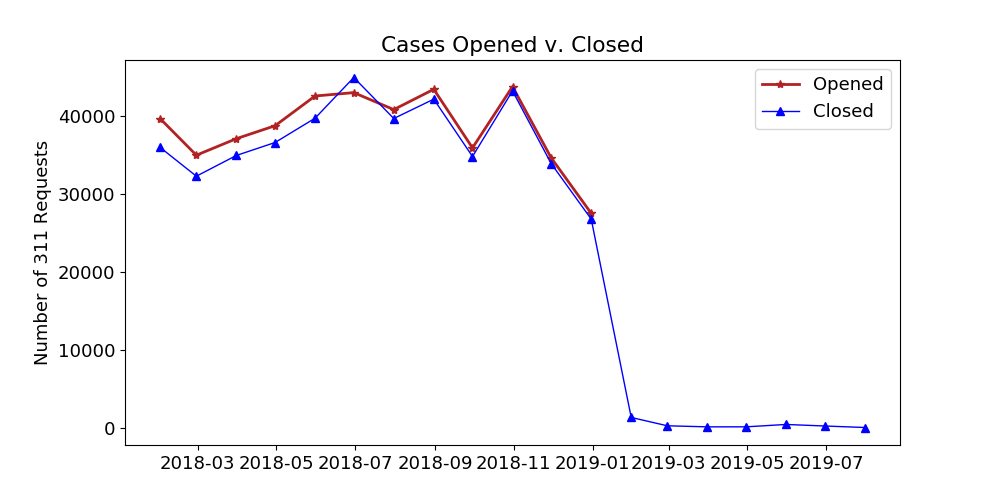
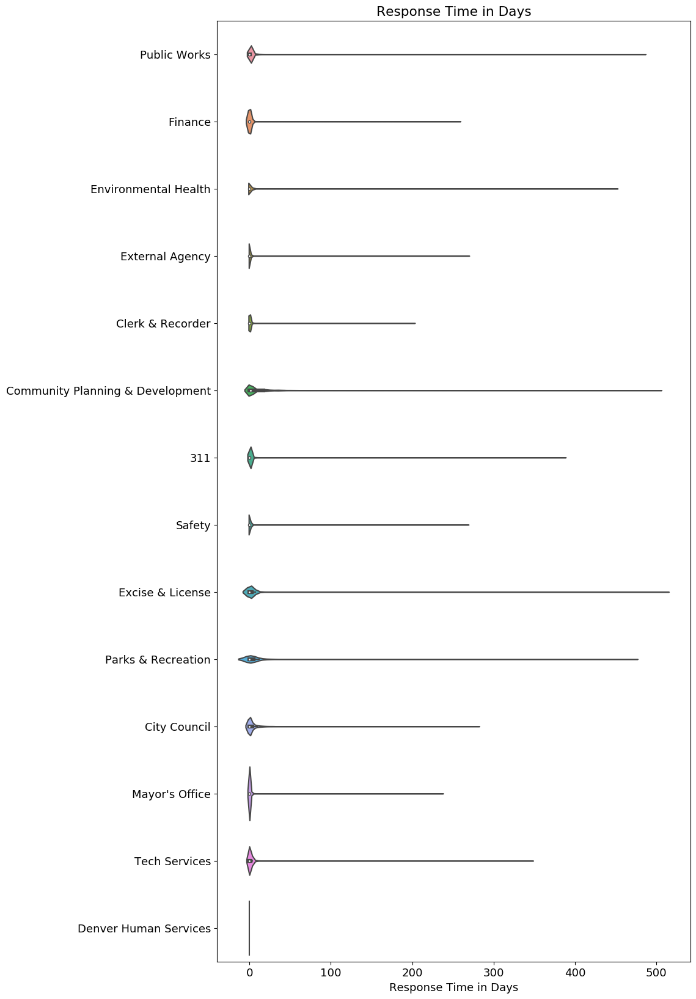
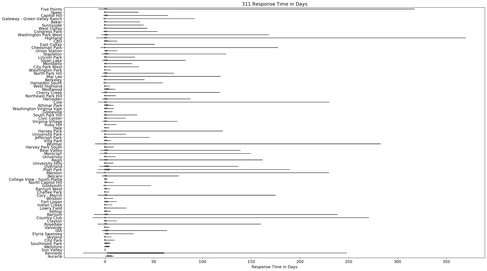
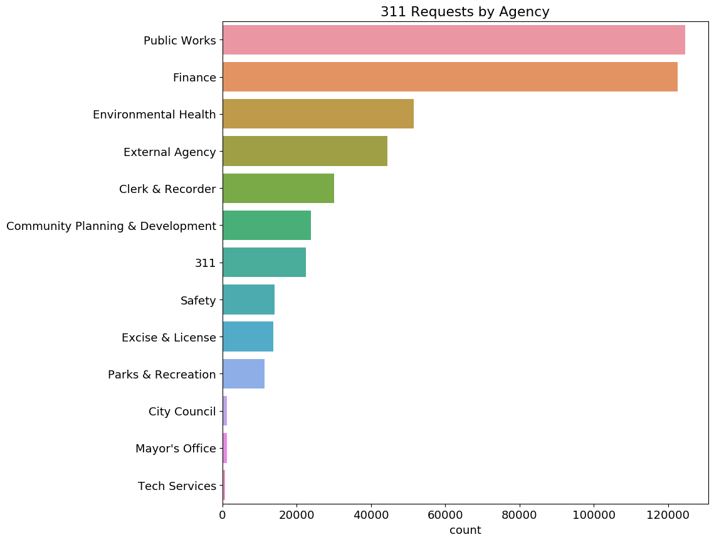
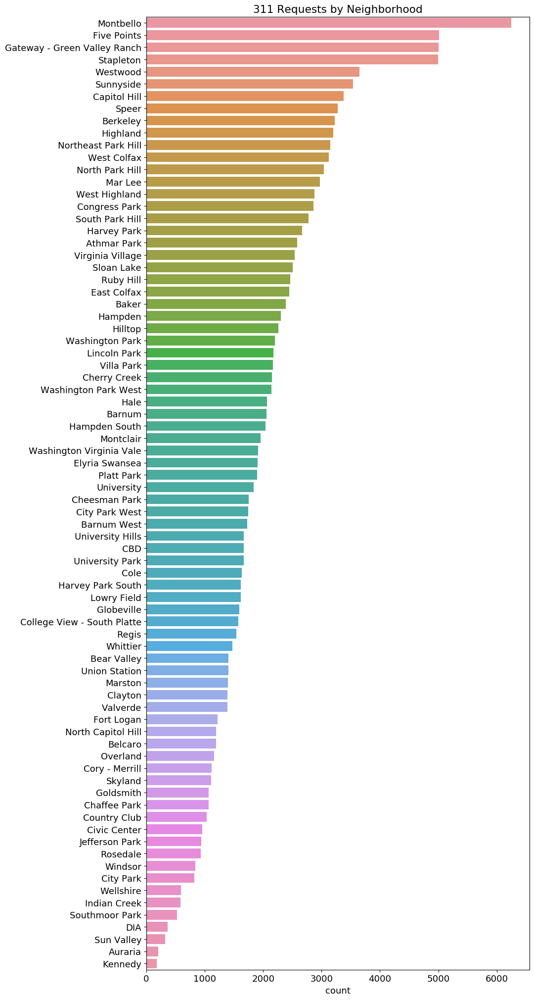

# 411-on-Denver-311

## Background & Motivation
The City of Denver provides several essential services to its residents through the use of a centralized city service portal known as Denver 311. According to their website:
 - Denver 311 provides residents with an effortless, accessible way to navigate city services. Our contact center staff demonstrate unparalleled customer service values, are leaders in innovative problem-solving, and deliver an unprecedented commitment to assist."

I sought out to discover whether to not Denver 311 actually assisted residents of the City of Denver in getting the information or services that they are requesting from the city. Basically to provide residents of Denver with the *411 on Denver 311*. 

## Data
The [Denver Open Data Catalog](https://www.denvergov.org/opendata/) has over 250 datasets that are available for free public use and distribution. The specific [Dataset](https://www.denvergov.org/opendata/dataset/city-and-county-of-denver-311-service-requests-2007-to-current) contains service requests submitted by citizens and businesses of Denver that will be forwarded to one of several agencies within the city’s bureaucratic structure. These requests range from graffiti clean-up, to pothole repair, help filing for an excise license, or looking for animal control to pick up a wild dog.  

The dataset is divided by year, with each year containing about 500,000 records. The records include a Case Summary of each request, the City Agency it was forwarded to, when the Case was opened and closed, and location data for approximately 165,000 of the requests by geographic coordinates that the city had converted from the address of the request.

However, this dataset was lacking the ability to categorize and analyze the data in any meaningful geographic way. I sought to add some clarity to the data by seeing if residents of any particular neighborhood were receiving better service from the city than others. To do this, I converted shape files from [this dataset](https://www.denvergov.org/opendata/dataset/city-and-county-of-denver-statistical-neighborhoods) to json format so that they could be imported through a GeoPandas data frame and joined with the coordinate data that I had in the service request dataset. In order to do this, it required fitting each geographic point into the neighborhood polygon or multipolygon that has a shape designed by a string of geographic coordinates. 

## Exploratory Data Analysis

### What is in My Data? 
After filtering out NaN values for all of the Case Summaries, it became clear that there is no real reasoning or structure to that column, but it does provide a text string with some insight into what people are requesting from each agency. For example, “Damaged/ Fallen Tree” was assigned to Parks & Recreation for action, it took them over 9 days to respond to this in the Washington Virginia Vale Neighborhood. There is also data on when a case was opened and closed, during 2018 Denver 311 closed 446,901 of the 461,741 cases that it opened.

### Closing Out Cases
The data shows that Denver 311 closes a majority of its cases very quickly, but some of them take a very long time to close. A brief peak into the data shows that the bulk of these cases that are quickly closed are from phone calls. 

As you can see, it varies greatly by agency how long it takes to close out the longest running cases, but the bulk are closed quickly.

It doesn't seem to matter all that much what neighborhood you live in. 

### Which agency receives the most 311 requests? How long does it take them to respond?
A breakdown of requests by agency and their response time is interesting to look at, but there are not many overall trends to be seen. Some of the agencies that receive the least requests take the most time to close them, but some of the largest agencies take a long time too. It's obviously a function of how many people work for the agency and complexity of the request, but I didn't have employment data to compute any trends. 

| Denver City Agency                 |     Requests     | Mean Response Time |
|------------------------------------|------------------|--------------------|
| 311                                |  22,524          |   1 days 07:15:19  |
| City Council                       |   1,211          |   6 days 23:05:09  |
| Community Planning & Development   |  23,847          |  13 days 12:31:41  |
| Denver Human Services              |       3          |          N/A       |
| Environmental Health               |  51,566          |   0 days 16:54:48  |
| Excise & License                   |  13,619          |   7 days 07:54:51  |
| External Agency                    |  44,401          |   0 days 06:07:44  |
| Finance                            | 122,549          |   3 days 13:29:02  |
| Mayor's Office                     |   1,194          |   0 days 19:22:49  |
| Parks & Recreation                 |  11,405          |  19 days 15:45:52  |
| Public Works                       | 124,613          |   2 days 12:48:34  |
| Safety                             |  13,996          |   0 days 07:35:25  |
| Tech Services                      |     663          |   2 days 15:59:35  |

This table shows how many requests each agency receives and the mean response time of the agencies. Mean is used to account for some of the longer closing times for some cases.

It's also interesting to see where these requests are coming from:

## Mapping Requests
The best way to look at this data is on a map that codes each data point by neighborhood. 

Here are all of the requests to Denver 311, this map breaks it out by agency based on sheer number of requests by neighborhood:

This map looks at the mean response time for the same info:

These maps focus on where our elected officials are receiving the most requests from:

Response time from the Mayor:

Response time from the City Council:

And the Clerk & Recorder:

The html file for both of these maps are located in the [folium folder](https://github.com/jpmiller10/411-on-Denver-311/tree/master/folium) folder of this repo and can be downloaded and run from your local machine.

## Conclusion
This data is very accessible when looking at it mapped, however, without a few more datasets being joined in to add functionality to some of the categories (i.e. employment data to analyze the output per city employee at each agency, or median home values for the neighborhood) the best application for this data is to use it as mapped. That way you can ask it a question about how long it will take to have a request fulfilled and you can navigate to a result. 
